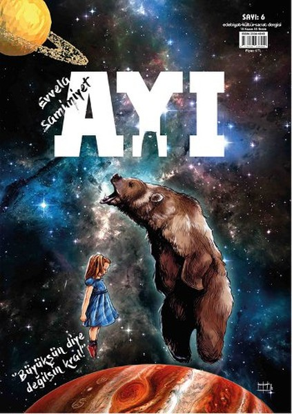
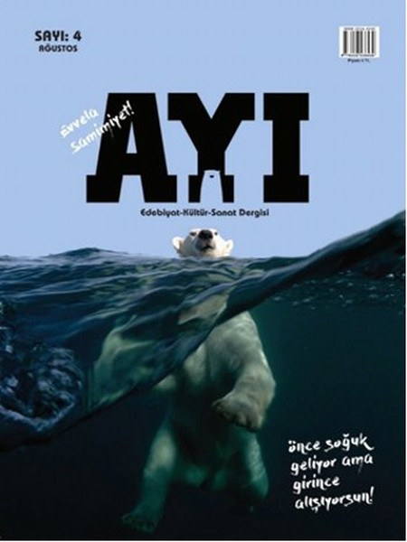
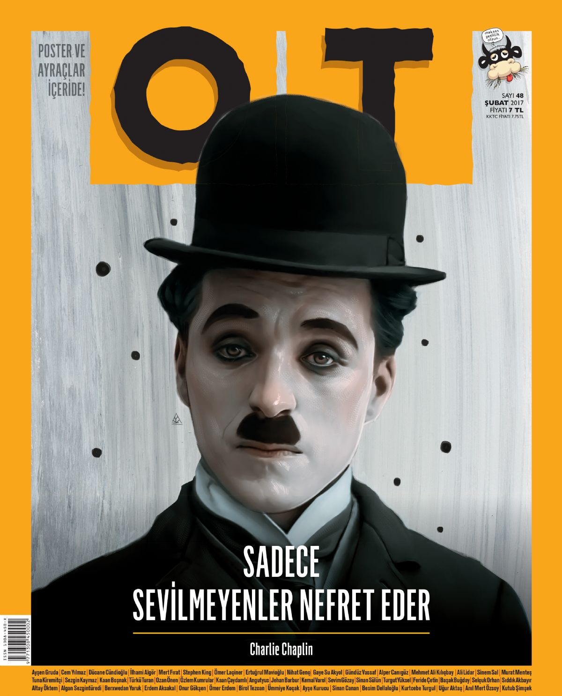

---HTML---
Warning: This document appears to be written in Turkish. Consider adding lang="tr" (or variant) to the html start tag.

From line 1, column 16; to line 2, column 6

TYPE html>↩<html>↩<head

For further guidance, consult Declaring the overall language of a page and Choosing language tags.

If the HTML checker has misidentified the language of this document, please file an issue report or send e-mail to report the problem.

Error: An img element must have an alt attribute, except under certain conditions. For details, consult guidance on providing text alternatives for images.

From line 21, column 18; to line 21, column 55

d="sepet">
Sep

Error: Element marquee not allowed as child of element div in this context. (Suppressing further errors from this subtree.)

From line 25, column 35; to line 25, column 104

d="yesil"><marquee behavior="scroll" direction="up" id="kayan-yazi" style="opa">↩	"Mar

Content model for element div:
If the element is a child of a dl element: one or more dt elements followed by one or more dd elements, optionally intermixed with script-supporting elements.
If the element is not a child of a dl element: Flow content.
Error: CSS: opa: Parse Error.

From line 25, column 35; to line 25, column 104

d="yesil"><marquee behavior="scroll" direction="up" id="kayan-yazi" style="opa">↩	"Mar

Error: An img element must have an alt attribute, except under certain conditions. For details, consult guidance on providing text alternatives for images.

From line 55, column 7; to line 55, column 62

li>↩      ↩    <

Error: An img element must have an alt attribute, except under certain conditions. For details, consult guidance on providing text alternatives for images.

From line 58, column 7; to line 58, column 62

li>↩      ↩    <

Error: An img element must have an alt attribute, except under certain conditions. For details, consult guidance on providing text alternatives for images.

From line 61, column 7; to line 61, column 62

li>↩      ↩    <

Error: An img element must have an alt attribute, except under certain conditions. For details, consult guidance on providing text alternatives for images.

From line 64, column 7; to line 64, column 62

li>↩      ↩    <

Error: An img element must have an alt attribute, except under certain conditions. For details, consult guidance on providing text alternatives for images.

From line 67, column 7; to line 67, column 62

li>↩      ↩    <

Error: Element object is missing one or more of the following attributes: data, type.

From line 76, column 19; to line 76, column 51

d="slayt"><object width="930" height="330">↩		<pa

Attributes for element object:
Global attributes
data - Address of the resource
type - Type of embedded resource
typemustmatch - Whether the type attribute and the Content-Type value need to match for the resource to be used
name - Name of nested browsing context
form - Associates the control with a form element
width - Horizontal dimension
height - Vertical dimension
Error: Stray end tag embed.

From line 78, column 51; to line 78, column 58

ght="330"></embed>↩		</o

Error: An img element must have an alt attribute, except under certain conditions. For details, consult guidance on providing text alternatives for images.

From line 84, column 37; to line 84, column 73

 href="#">
OT 

Error: An img element must have an alt attribute, except under certain conditions. For details, consult guidance on providing text alternatives for images.

From line 85, column 37; to line 85, column 77

 href="#">
Mas

Error: An img element must have an alt attribute, except under certain conditions. For details, consult guidance on providing text alternatives for images.

From line 86, column 37; to line 86, column 74

 href="#">
Ayı

Error: An img element must have an alt attribute, except under certain conditions. For details, consult guidance on providing text alternatives for images.

From line 87, column 37; to line 87, column 73

 href="#">
Fil

Error: An img element must have an alt attribute, except under certain conditions. For details, consult guidance on providing text alternatives for images.

From line 88, column 37; to line 88, column 75

 href="#">
Mas

Error: An img element must have an alt attribute, except under certain conditions. For details, consult guidance on providing text alternatives for images.

From line 89, column 37; to line 89, column 74

 href="#">
Ayı

Error: An img element must have an alt attribute, except under certain conditions. For details, consult guidance on providing text alternatives for images.

From line 90, column 37; to line 90, column 73

 href="#">
OT 

Error: An img element must have an alt attribute, except under certain conditions. For details, consult guidance on providing text alternatives for images.

From line 91, column 37; to line 91, column 74

 href="#">
OT 

Error: Bad value sosyal-medya\email.png for attribute src on element img: Backslash ("\") used as path segment delimiter.

From line 98, column 17; to line 98, column 70

 href="#"></a></

Error: An img element must have an alt attribute, except under certain conditions. For details, consult guidance on providing text alternatives for images.

From line 98, column 17; to line 98, column 70

 href="#"></a></

Error: Bad value sosyal-medya\fb.png for attribute src on element img: Backslash ("\") used as path segment delimiter.

From line 99, column 17; to line 99, column 67

 href="#"></a></

Error: An img element must have an alt attribute, except under certain conditions. For details, consult guidance on providing text alternatives for images.

From line 99, column 17; to line 99, column 67

 href="#"></a></

Error: Bad value sosyal-medya\instagram.png for attribute src on element img: Backslash ("\") used as path segment delimiter.

From line 100, column 17; to line 100, column 74

 href="#"></a></

Error: An img element must have an alt attribute, except under certain conditions. For details, consult guidance on providing text alternatives for images.

From line 100, column 17; to line 100, column 74
---CSS---
Warning: This document appears to be written in English. Consider adding lang="en" (or variant) to the html start tag.

From line 1, column 1; to line 1, column 3

* {↩	padd

For further guidance, consult Declaring the overall language of a page and Choosing language tags.

If the HTML checker has misidentified the language of this document, please file an issue report or send e-mail to report the problem.

Error: Non-space characters found without seeing a doctype first. Expected <!DOCTYPE html>.

From line 1, column 1; to line 1, column 3

* {↩	padd

Error: Element head is missing a required instance of child element title.

From line 1, column 1; to line 1, column 3

* {↩	padd

Content model for element head:
If the document is an iframe srcdoc document or if title information is available from a higher-level protocol: Zero or more elements of metadata content, of which no more than one is a title element and no more than one is a base element.
Otherwise: One or more elements of metadata content, of which exactly one is a title element and no more than one is a base element.
 href="#"></a></
